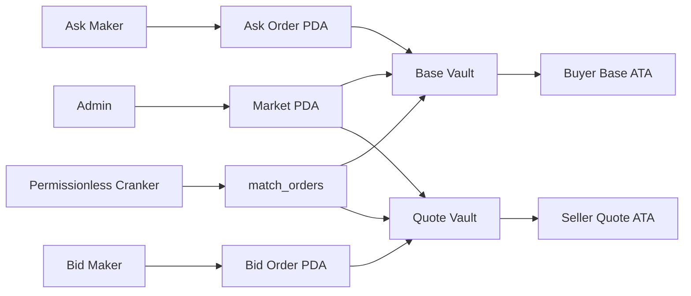

# CoreMatch

CoreMatch is a Solana Anchor program that rebuilds a Web2-style centralized matching backend as an on-chain state machine. Instead of a single Redis order book and a trusted server loop, CoreMatch uses flat PDAs for orders, program-owned token vaults for escrow, and permissionless cranking for matching.

Program ID: `8WbYeq7UEdUoPm7RLEkuVRGvaCvaZx4tn2aaZta8QA5X`

## Vision

Traditional exchanges keep open orders in memory, serialize all matching through one backend, and rely on a trusted operator to move balances. CoreMatch moves those responsibilities on-chain:

- `Market` stores the global config for a base/quote pair.
- `Order` stores one PDA per order, which avoids a giant shared array and dramatically reduces write-lock contention.
- `base_vault` and `quote_vault` hold escrowed SPL tokens under program control.
- `match_orders` is permissionless, so any wallet can act like a decentralized matching worker.

## Web2 vs Solana

| Concern | Web2 matching backend | CoreMatch |
| --- | --- | --- |
| Order storage | Redis / in-memory heap | One `Order` PDA per order |
| Matching loop | Trusted server | Permissionless crank instruction |
| Asset custody | Centralized ledger or exchange wallet | Program-owned SPL token vaults |
| Fault domain | Single operator / service cluster | Distributed validator set |
| Write contention | Centralized memory lock | Parallelizable flat PDAs |

## Account Model



### Market PDA

Seeds: `[b"market", admin.key().as_ref()]`

Fields:

- `admin`
- `base_mint`
- `quote_mint`
- `base_vault`
- `quote_vault`
- `bump`

### Order PDA

Seeds: `[b"order", market.key().as_ref(), maker.key().as_ref(), order_id.to_le_bytes().as_ref()]`

Fields:

- `maker`
- `market`
- `order_id`
- `is_bid`
- `price`
- `base_amount`
- `filled_base_amount`
- `bump`

## Instruction Set

### `initialize_market`

- Creates the `Market` PDA.
- Creates `base_vault` and `quote_vault` token accounts owned by the market PDA.

### `place_order`

- Creates an `Order` PDA.
- Bids escrow quote tokens in `quote_vault`.
- Asks escrow base tokens in `base_vault`.

### `cancel_order`

- Requires the maker signer.
- Refunds the remaining escrowed balance to the maker.
- Closes the order PDA and returns rent to the maker.

### `match_orders`

- Permissionless entrypoint for any cranker.
- Requires a crossing bid and ask on the same market.
- Executes at the bid price.
- Transfers base to the buyer and quote to the seller.
- Updates fill state, then closes fully filled orders and refunds rent to the original makers.
- Validates the settlement token accounts so a cranker cannot redirect funds.

## Why Flat PDAs

Flat PDAs are the core design choice in this project:

- They avoid write-lock contention from a monolithic market account.
- They scale beyond a single account’s size limits.
- They keep transactions smaller by touching only the orders being matched.
- They let unrelated users place, cancel, and match orders concurrently.

## Tradeoffs

- Matching is currently two orders per transaction, so large sweeps require multiple cranks.
- CPI-based SPL transfers add compute overhead compared with an off-chain engine.
- Price-time priority is not globally enforced on-chain yet; the crank chooses which crossing pair to submit.
- Settlement assumes makers already have the required associated token accounts on devnet.

## Repository Status

Completed:

- Anchor workspace scaffolded
- `Market` and `Order` account model implemented
- `initialize_market`, `place_order`, `cancel_order`, and `match_orders` implemented
- Custom program errors added
- TypeScript integration tests added
- Next.js frontend scaffolded and wired to the program

## Automated Verification

Run from the repository root:

```bash
anchor build
anchor test
```

Run the frontend:

```bash
cd app
npm install
npm run dev
```

## Test Coverage

`anchor test` covers:

- Market initialization
- Bid placement
- Ask placement
- Exact-price full fills
- Partial fills
- `PriceNotCrossed`
- Unauthorized cancel attempts
- Cranker settlement redirection rejection

## Devnet Usage

The frontend targets devnet. The default `Anchor.toml` provider stays on localnet so `anchor test` can run against a local validator, while the devnet program address is also configured.

Deploy manually when you want a fresh devnet build:

```bash
solana config set --url devnet
anchor build
anchor deploy --provider.cluster devnet
```

Useful links:

- Program explorer: [CoreMatch Program](https://explorer.solana.com/address/8WbYeq7UEdUoPm7RLEkuVRGvaCvaZx4tn2aaZta8QA5X?cluster=devnet)
- Deployment TX: `<insert tx link>`
- Example match TX: `<insert tx link>`

## Frontend Overview

The Next.js app in [`/Users/admin/Desktop/Meowfi/CoreMatch/app`](/Users/admin/Desktop/Meowfi/CoreMatch/app) includes:

- Order entry panel for bids and asks
- Live order book fetched from open order PDAs
- Permissionless crank button that finds the best crossing pair
- Devnet wallet connection via Solana wallet adapter

## Manual Verification Plan

1. Run `anchor test` and confirm all tests pass locally.
2. Start the frontend with `cd app && npm run dev`.
3. Connect a devnet wallet that already has the required SPL token associated token accounts.
4. Confirm placing a bid escrows quote tokens into `quote_vault`.
5. Confirm placing an ask escrows base tokens into `base_vault`.
6. Use the crank button and confirm the match settles to the makers’ ATAs.

## Notes

- Current execution price is the bid price.
- `order_id: u64` is part of the PDA seeds so one maker can place multiple orders on the same market.
- The frontend auto-discovers the first market PDA it finds on devnet.
